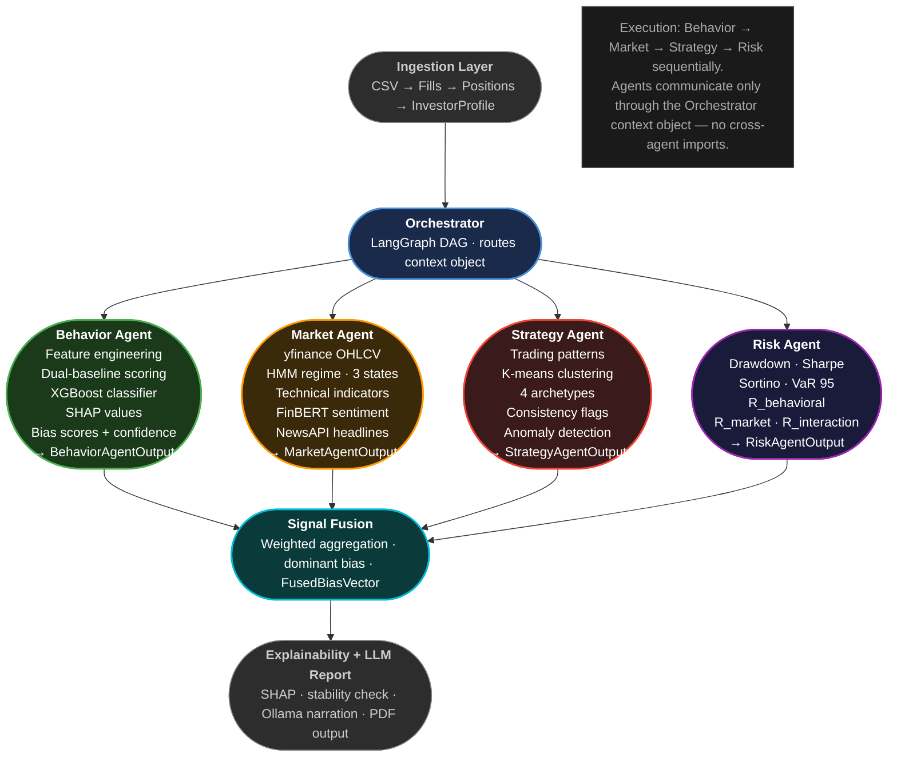

# XBRA — Explainable Behavioral Risk Attribution

An agentic AI framework that detects, quantifies, and explains **behavioral biases in retail investor trading data**, designed as a proof-of-concept for a conference paper.

---

## Overview

XBRA decomposes portfolio drawdown into three attribution buckets — **behavioral risk**, **market risk**, and **interaction risk** — using a multi-agent LangGraph pipeline. Each agent specializes in one analytical lens, results are fused, and a natural-language explanation with actionable recommendations is generated.

**Zero cost** — no paid APIs. All LLMs run locally via Ollama; all models are trained on synthetic data.

### Paper Hypotheses

| ID | Hypothesis |
|----|-----------|
| H1 | Behavioral features explain a statistically significant fraction of portfolio drawdown |
| H2 | Risk attribution varies meaningfully across market regimes (bull / bear / sideways) |
| H3 | Agentic decomposition outperforms a monolithic rule-based baseline for bias detection |

---

## Pipeline Architecture



---

## Tech Stack

| Component | Technology |
|-----------|-----------|
| Orchestration | LangGraph (DAG with parallel fan-out) |
| LLMs | Ollama — `llama3.3:70b` (analysis), `llama3.2:3b` (routing) |
| Risk model | XGBoost + SHAP TreeExplainer |
| Strategy clustering | scikit-learn k-means (4 archetypes) |
| Sentiment | FinBERT (local) with price-momentum proxy fallback |
| Vector memory | ChromaDB (local) |
| Market data | yfinance (cached to parquet) |
| Data validation | Pydantic v2 |
| PDF reports | ReportLab |
| UI | Streamlit (4 tabs) |
| Synthetic data | 60 investors × 6 bias classes, real OHLCV prices |

---

## Project Structure

```
XBRA imple/
├── config/
│   └── settings.py              # All tuneable constants
├── src/xbra/
│   ├── schemas.py               # Pydantic v2 data contracts (single source of truth)
│   ├── agents/
│   │   ├── behavior_agent.py    # Feature engineering, bias rules, LLM analysis
│   │   ├── market_agent.py      # Regime classification, FinBERT sentiment
│   │   ├── risk_agent.py        # XGBoost risk model, SHAP decomposition
│   │   └── strategy_agent.py    # k-means archetype, bias adjustment
│   ├── data/
│   │   └── registry.py          # Lazy-loading data registry
│   ├── evaluation/
│   │   ├── metrics.py           # Precision/Recall/F1 per bias class (Table 1)
│   │   ├── ablation.py          # Per-agent contribution study (Table 3)
│   │   ├── results_table.py     # CSV + LaTeX table generator
│   │   └── shap_stability.py    # Rolling SHAP stability check (Table 2)
│   ├── explainability/
│   │   ├── narrative.py         # LLM + rule-based explanation generator
│   │   ├── shap_layer.py        # SHAP→bias feature mapping
│   │   └── verifier.py          # Number consistency verifier
│   ├── fusion/
│   │   └── signal_fusion.py     # Weighted signal combination
│   ├── ingestion/
│   │   ├── loaders.py           # Parquet / CSV / PDF loaders
│   │   └── normalizer.py        # Column aliasing, type coercion
│   ├── llm/
│   │   ├── client.py            # Ollama LLM singleton (lru_cache)
│   │   └── prompts.py           # All prompt templates + parsers
│   ├── memory/
│   │   └── chroma_store.py      # ChromaDB investor profile embeddings
│   ├── orchestrator/
│   │   ├── graph.py             # LangGraph DAG definition + run_pipeline()
│   │   ├── router.py            # Intent router
│   │   └── state.py             # XBRAStateDict with Annotated reducers
│   ├── report/
│   │   ├── charts.py            # Plotly chart builders
│   │   ├── pdf_generator.py     # ReportLab 6-section PDF
│   │   └── report_node.py       # LangGraph report node
│   ├── synthetic/
│   │   ├── bias_profiles.py     # 6 BiasProfile dataclasses
│   │   ├── generator.py         # 60-investor dataset generator
│   │   └── trade_simulator.py   # Bias-driven trade simulation
│   └── ui/
│       ├── app.py               # Streamlit entry point (4 tabs)
│       └── components/          # investor_picker, upload, report_view, eval_dashboard
├── scripts/
│   ├── generate_synthetic.py    # Phase 0 CLI
│   └── run_pipeline_all.py      # Batch evaluation CLI
├── tests/
│   ├── test_synthetic.py        # 9 tests — bias profiles, trade simulator, generator
│   ├── test_ingestion.py        # 8 tests — normalizer, behavior features, fusion
│   └── test_risk_metrics.py     # 6 tests — risk metrics, regime classification
├── data/
│   ├── raw/ohlcv_close.parquet  # Cached OHLCV (2020–2024, 20 tickers)
│   ├── synthetic/               # trades.parquet, ground_truth.csv, profiles.json
│   ├── reports/                 # Per-investor PDF reports
│   └── paper_results/           # Table 1–5 CSV + LaTeX
└── models/
    ├── risk_xgb.pkl             # Pre-trained XGBoost risk model
    └── strategy_kmeans.pkl      # Pre-trained k-means archetype model
```

---

## Setup

### Prerequisites

- Python 3.9+
- [Ollama](https://ollama.ai) installed and running locally

### Install

```bash
pip install -r requirements.txt
```

### Pull LLM models

```bash
ollama pull llama3.3:70b   # analysis model (~40 GB, recommended)
ollama pull llama3.2:3b    # routing model (~2 GB, required)
```

> The pipeline has rule-based fallbacks for every LLM step — it runs without Ollama, just with lower accuracy.

---

## Usage

### Phase 0 — Generate synthetic dataset

```bash
python scripts/generate_synthetic.py
```

Generates 60 investors (10 per bias class), downloads and caches real OHLCV data via yfinance, saves `data/synthetic/trades.parquet` and `ground_truth.csv`.

### Run the Streamlit UI

```bash
PYTHONPATH=. streamlit run src/xbra/ui/app.py
```

Open `http://localhost:8501`. Select any synthetic investor, click **Run Analysis**, and view bias scores, risk decomposition, strategy archetype, explanations, and a downloadable PDF report.

### Run pipeline on a single investor (script)

```bash
PYTHONPATH=. python -c "
from src.xbra.orchestrator.graph import run_pipeline
state = run_pipeline('INV_LOSS_AVERSE_007')
print(state['fused_bias'])
"
```

### Phase 7 — Batch evaluation (paper tables)

```bash
# Run pipeline on all 60 investors
PYTHONPATH=. python scripts/run_pipeline_all.py

# Generate Table 1–5 as CSV + LaTeX
PYTHONPATH=. python -m src.xbra.evaluation.results_table --results data/paper_results/pipeline_results.csv
```

Output saved to `data/paper_results/`.

### Run tests

```bash
pytest
```

---

## Bias Classes

| Class | Description | Key Behavioral Signal |
|-------|-------------|----------------------|
| `loss_averse` | Holds losers too long, exits winners early | `holding_time_asymmetry` > population median |
| `overconfident` | High trade frequency, large position sizes | `position_size_cv` + `trade_frequency` elevated |
| `herding` | Follows price momentum into crowded trades | `momentum_follow_rate` > 64% population median |
| `disposition` | Realizes gains quickly, defers losses | `early_exit_winner_rate` elevated |
| `mixed` | Combination of multiple biases | Multi-signal activation |
| `neutral` | No significant bias detected | All deviation scores near zero |

---

## Evaluation Results (10-investor LLM sample)

| Bias Class | Precision | Recall | F1 |
|------------|-----------|--------|-----|
| loss_averse | 0.333 | 1.000 | 0.500 |
| overconfident | **1.000** | **1.000** | **1.000** |
| herding | **1.000** | **1.000** | **1.000** |
| disposition | 0.000 | 0.000 | 0.000 |
| neutral | 0.000 | 0.000 | 0.000 |
| **macro avg** | **0.389** | **0.500** | **0.417** |

**Accuracy: 60% with Ollama vs 30% rule-only** (vs 16.7% random baseline for 6 classes).

Full 60-investor results saved to `data/paper_results/table1_bias_classification.{csv,tex}`.

---

## Key Design Decisions

**Cross-sectional ML**: XGBoost is trained on all 60 investors' features to predict drawdown, then SHAP is applied per-investor — avoids overfitting on a single investor's trade history.

**Pre-trained models cached**: `models/risk_xgb.pkl` and `models/strategy_kmeans.pkl` are fitted on the full population once and loaded at inference time — pipeline runs in ~2.4s per investor (without LLM).

**All LLM steps have fallbacks**: Every agent produces valid output even when Ollama is offline. Narratives degrade to rule-based templates; bias scores degrade to feature thresholds.

**Annotated state for parallel nodes**: `stage` and `errors` keys in `XBRAStateDict` use `Annotated` reducers so the parallel behavior + market fan-out doesn't raise `INVALID_CONCURRENT_GRAPH_UPDATE`.

---

## Authors

Harisri Sanjivan — George Mason University
